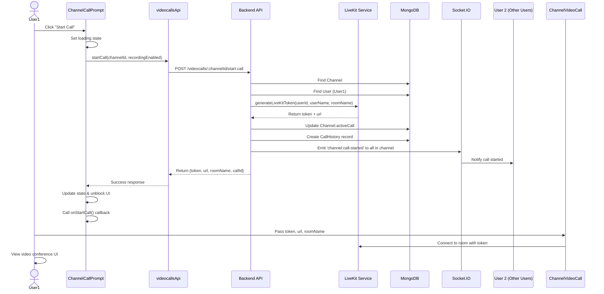
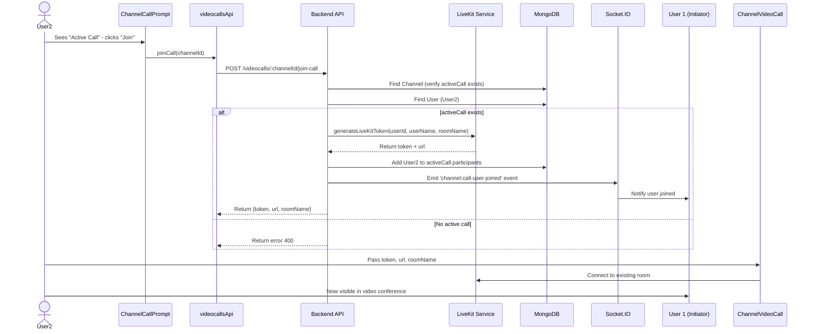
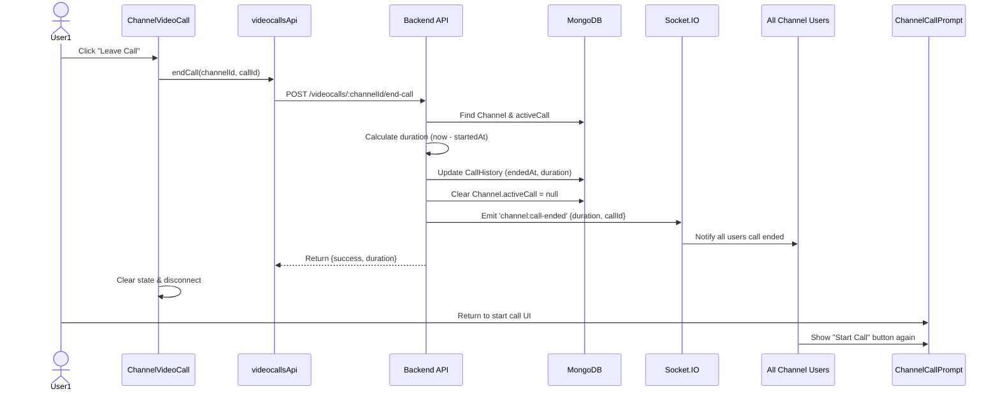
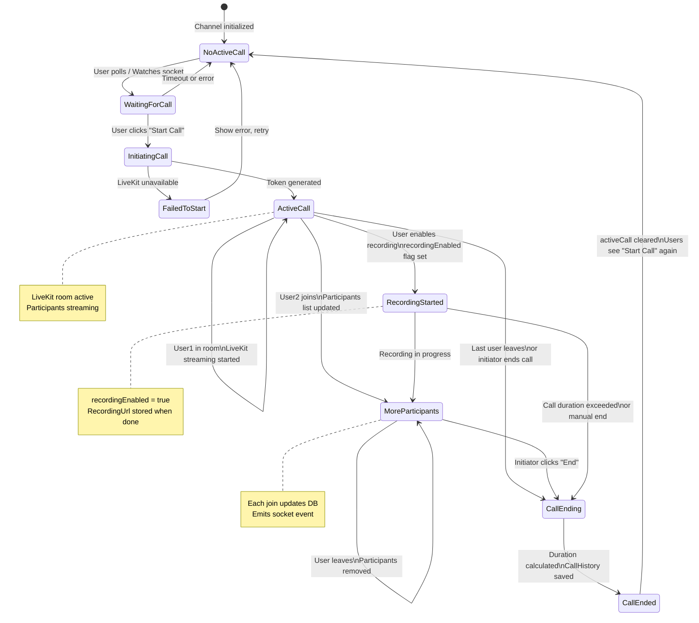
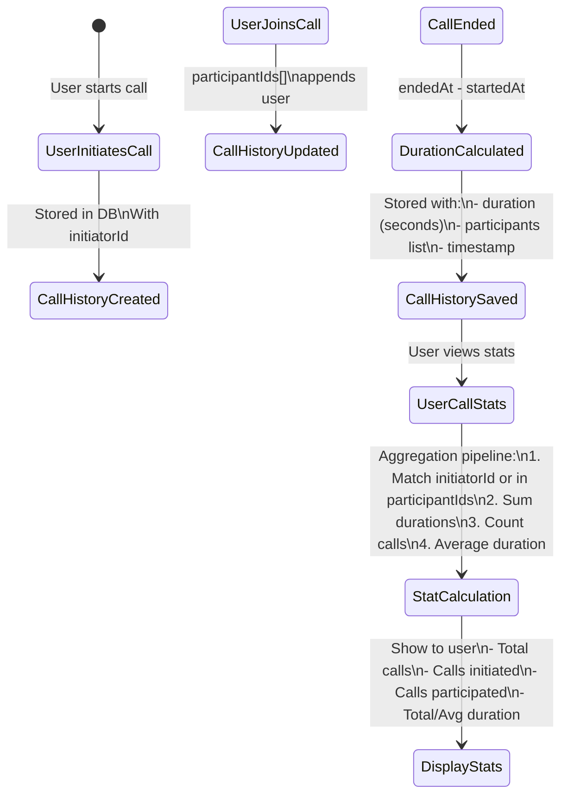
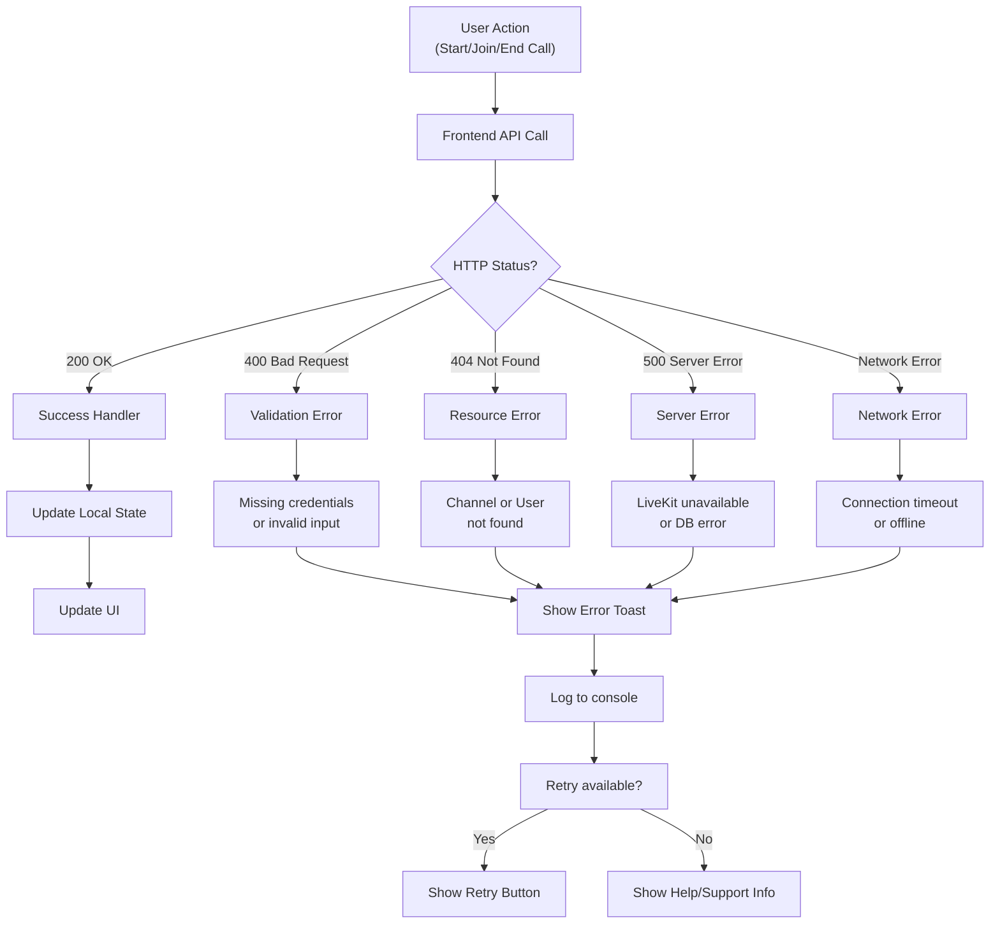
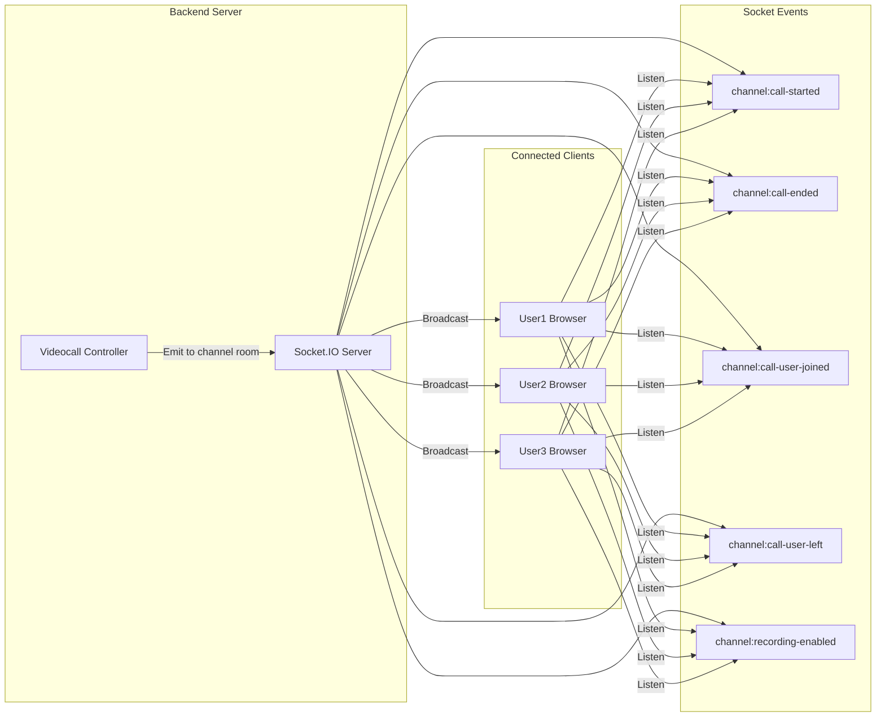

# Videocall Flow Diagrams

## Sequence Diagram: Starting a Video Call



---

## Sequence Diagram: Joining an Existing Call



---

## Sequence Diagram: Ending a Call



---

## State Transition Diagram



---

## Data Flow: Call History Statistics



---

## Component Interaction Tree

```
Frontend Entry Point
│
└─ Channel View Page
   │
   ├─ ChannelCallPrompt.tsx
   │  ├─ State: hasActiveCall, activeParticipants, recordingEnabled
   │  ├─ Effects:
   │  │  ├─ Poll checkForActiveCall() every 5s
   │  │  └─ Listen to socket events:
   │  │     ├─ 'channel:call-started'
   │  │     ├─ 'channel:call-ended'
   │  │     ├─ 'channel:call-user-joined'
   │  │     └─ 'channel:call-user-left'
   │  └─ Callbacks: onStartCall(), onJoinCall()
   │
   ├─ ChannelVideoCall.tsx (conditionally rendered)
   │  ├─ Props: token, url, roomName, callId
   │  ├─ State: callDuration, isRecording, screenShareActive
   │  ├─ Children: LiveKitRoom component
   │  │  └─ VideoConference (UI controls)
   │  └─ Handlers:
   │     ├─ handleEnableRecording()
   │     ├─ handleLeaveRoom()
   │     └─ formatDuration()
   │
   └─ CallHistoryView.tsx / UserCallStatsView.tsx (separate section)
      ├─ Load call history on mount
      ├─ Load user statistics on mount
      └─ Display formatted data

API Layer (videocallsApi)
│
├─ startCall(channelId, recordingEnabled)
├─ joinCall(channelId)
├─ leaveCall(channelId)
├─ endCall(channelId, callId)
├─ getCallInfo(channelId)
├─ getCallHistory(channelId, limit, skip)
├─ enableRecording(channelId, callId)
└─ getUserCallStats()

Backend Layer
│
├─ videocalls.routes.ts
│  └─ 8 endpoints (all require authMiddleware)
│
├─ videocalls.controller.ts
│  ├─ startChannelVideoCall()
│  ├─ joinChannelVideoCall()
│  ├─ endChannelVideoCall()
│  ├─ leaveChannelVideoCall()
│  ├─ getChannelCallInfo()
│  ├─ getChannelCallHistory()
│  ├─ enableRecording()
│  └─ getUserCallStats()
│
├─ livekit.service.ts
│  ├─ generateLiveKitToken()
│  ├─ generateRoomName()
│  └─ handleLiveKitWebhook() [optional]
│
└─ socket.ts
   ├─ Socket.IO initialization
   ├─ Authentication middleware
   ├─ Room bootstrap (join channels on connect)
   ├─ Event handlers:
   │  ├─ join_channel
   │  ├─ leave_channel
   │  ├─ send_message
   │  └─ disconnect
   └─ Event emitters:
      ├─ channel:call-started
      ├─ channel:call-ended
      ├─ channel:call-user-joined
      ├─ channel:call-user-left
      └─ channel:recording-enabled

Database
│
├─ ChannelModel
│  └─ activeCall: { roomName, startedAt, participants[] }
│
├─ CallHistoryModel
│  ├─ channelId
│  ├─ roomName
│  ├─ initiatorId (ref: users)
│  ├─ participantIds (ref: users)
│  ├─ startedAt / endedAt
│  ├─ duration
│  ├─ recordingUrl
│  ├─ recordingEnabled
│  └─ Index: { channelId: 1, startedAt: -1 }
│
└─ UserModel (referenced in calls)

External Services
│
└─ LiveKit
   ├─ generateLiveKitToken (via backend)
   ├─ Connect room (frontend component)
   ├─ Stream audio/video
   ├─ Optionally: recording
   └─ Webhook events (optional)
```

---

## Error Handling Flow



---

## LiveKit Integration Points

```
┌─────────────────────────────────────────────────────┐
│                YOUR APPLICATION                     │
└─────────────────────────────────────────────────────┘
              │                            │
         [1] │ generateLiveKitToken()     │ [5] Connect with token
              │ (Backend)                   │
              ▼                            ▼
┌─────────────────────────────────────────────────────┐
│  LiveKit Server Service                             │
│  (LIVEKIT_URL from env)                            │
│                                                     │
│  Generates Access Token with:                       │
│  - room (channel name)                              │
│  - roomJoin (true)                                  │
│  - canPublish (true)                                │
│  - canPublishData (true)                            │
│  - canSubscribe (true)                              │
└─────────────────────────────────────────────────────┘
              │
    [2] JWT Token with credentials
              │
         [3] Frontend receives token
              │
         [4] Frontend creates room connection
              │
        ┌─────────────────────────────┐
        │  LiveKit Room               │
        │  - Media streaming          │
        │  - Participant management   │
        │  - Recording (optional)     │
        │  - Data channel messaging   │
        └─────────────────────────────┘


Environment Configuration:
LIVEKIT_URL=
  └─ Development: http://localhost:7880
  └─ Production: https://livekit.yourdomain.com

LIVEKIT_API_KEY=
  └─ Used to sign tokens

LIVEKIT_API_SECRET=
  └─ Signing secret (keep private)
```

---

## Call Duration Calculation

```
Timeline:
═════════════════════════════════════════════════════

User1 starts call
│
│ activeCall.startedAt = NOW
├─────────────────┐
│                 │
User2 joins       │ (participants array grows)
│                 │
user3 joins       │
│                 │
User1 ends call   │
│                 └─────────────────────────────► endedAt = NOW
│
│ Duration = (endedAt - startedAt) in seconds
│
CallHistory saved:
{
  startedAt: "2024-04-05T10:30:00Z",
  endedAt: "2024-04-05T10:45:30Z",
  duration: 930  // seconds
}

For Statistics:
- totalDuration = SUM of all durations for user
- averageDuration = totalDuration / numberOfCalls
```

---

## Socket Event Flow Diagram



